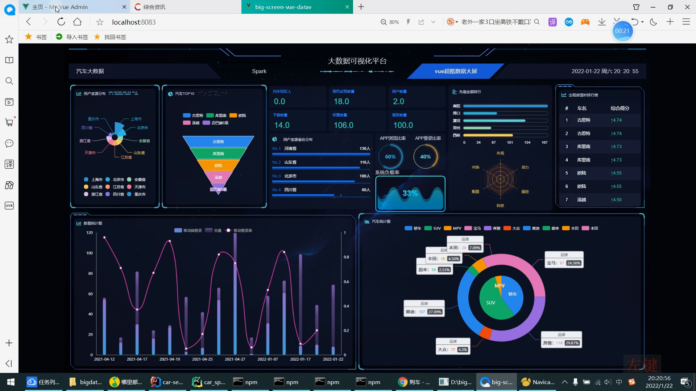

# 计算机毕业设计之Python+Spark汽车推荐系统 汽车可视化 汽车数据分析 汽车大数据 汽车推荐app 汽车小程序 大数据毕业设计

## 要求
### 源码有偿一套(论文 PPT 源码+sql脚本)
### 
### 加好友前帮忙start一下，并备注github有偿获取源码
### 我的QQ号是2877135669 或者 1679232425
### 加qq好友说明（被部分  网友整得心力交瘁）：
    1.加好友务必按照格式备注
    2.避免浪费各自的时间

https://www.bilibili.com/video/BV1cb4y1n7Yy?spm_id_from=333.999.0.0

## 开发技术
Hadoop、HDFS、Spark、SpringBoot、echarts、Spark、Python、MySQL、Vue.js

## 创新点
大数据架构、爬虫、数据可视化、短信、百度AI身份证识别、阿里云短信接口、支付宝沙箱支付

app+web

## 补充说明
适合大数据毕业设计、数据分析、爬虫类计算机毕业设计

## 功能

最近移动端的沙箱支付不太稳定，经常报订单不存在，可以不管，直接多点几次，仍然可以支付的。

\## Vue spark 懂车帝汽车大数据大屏

\### 技术

\+ 基于spark java API

\### 实现分析功能

\+ 基础情况：预约流程、汽车经纪人、用户统计 ---OK

\+ 登录情况：APP登录和PC端登录分开统计 ---OK

\+ 预约试驾情况： 统计 ---OK

\+ 收藏新闻情况 ---OK

\+ 用户按照省份来源排行统计、柱状图 ---OK

\+ 用户的来源构成饼图 ---OK

\+ 用户订单排行榜（金主排行榜） ---OK

\+ 登录趋势折线图（按照日期） ---OK

\+ 汽车按照类型（轿车、SUV、MPV） 和品牌（宝马、奔驰、奥迪等） 做一个环状组合饼图 ---OK

\+ 懂车弟，汽车外观、内饰、科技、动力、操控六维雷达图 ---OK

## 开发技术

spark、hadoop、springboot、vue.js、python、百度AI平台、支付宝沙箱支付、阿里云短信接口、vant

## 特色

app/小程序+web双端

大屏可视化(用spark分析)

短信注册

在线支付

身份证自动上传识别

# 运行截图

# 运行视频(B站)

https://www.bilibili.com/video/BV1cb4y1n7Yy?spm_id_from=333.999.0.0

